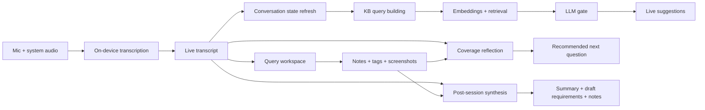

# OpenOats - Query

[Auto-Maintainer](https://am.whhite.com)

A meeting note-taker that talks back.


OpenOats sits next to your call, transcribes both sides of the conversation in real time, and searches your own notes to surface things worth saying — right when you need them.


## Features

- **Invisible to the other side** — the app window is hidden from screen sharing by default, so no one knows you're using it
- **Fully offline transcription** — speech recognition runs entirely on your Mac; no audio ever leaves the device
- **Runs 100% locally** — pair with [Ollama](https://ollama.com/) or [LM Studio](https://lmstudio.ai/) for local LLMs and embeddings, and nothing touches the network at all
- **Pick any LLM** — use [OpenRouter](https://openrouter.ai/) for cloud models (GPT-4o, Claude, Gemini), or local providers like Ollama and LM Studio
- **Live transcript** — see both sides of the conversation as it happens, copy the whole thing with one click
- **Auto-saved sessions** — every conversation is automatically saved as a plain-text transcript and a structured session log, no manual export needed
- **Knowledge base search** — point it at a folder of notes and it pulls in what's relevant using [Voyage AI](https://www.voyageai.com/) embeddings, local Ollama or LM Studio embeddings, or any OpenAI-compatible endpoint (llama.cpp, llamaswap, LiteLLM, vLLM, etc.)
- **Interview guidance** — Query mode watches the transcript, your notes, tags, and screenshots to suggest what to ask next and which requirement gaps are still thin
- **Structured summaries** — after an interview, OpenOats can turn the captured evidence into extracted facts, open questions, and draft requirements

## How it works

1. You start a call and hit **Live**
2. OpenOats transcribes both speakers locally on your Mac
3. The live transcript becomes the shared spine for everything else: grounded suggestions, Query guidance, and post-session summaries
4. In classic mode, OpenOats searches your knowledge base and decides whether a suggestion is worth surfacing
5. In Query mode, it reflects on the live transcript plus your notes, tags, and screenshots to recommend the next question or probe
6. After the session, it can turn the captured evidence into structured notes and a requirements-oriented summary




## AI beyond transcription

OpenOats uses AI for more than speech-to-text:

- **Grounded live assistance** — it turns recent conversation into search queries, retrieves relevant material from your knowledge base, and uses an LLM to decide whether a suggestion is worth showing before drafting the final talking point
- **Conversation-state modeling** — during live assistance, it periodically refreshes a compact state of the conversation (topic, summary, open questions, tensions, goals) so suggestions stay aligned with where the call is actually going
- **Real-time reflection in Query mode** — yes, there is a live reflection layer that informs the next action. It continuously reviews the transcript together with your notes, tags, and screenshots, checks which requirement slots are covered (purpose, decisions, exceptions, controls, data, outputs, metrics, etc.), detects the current interview mode, and suggests the next line of questioning
- **Post-session synthesis** — after the interview, it can assemble a structured summary artifact with extracted facts, explicit evidence references, open questions, and inferred draft requirements

That real-time reflection is currently a guidance layer for the human, not an autonomous agent that takes actions on its own. In other words: OpenOats does not just transcribe; it actively helps you decide what to ask, what to verify, and what is still missing.

## Recording Consent & Legal Disclaimer

**Important:** OpenOats records and transcribes audio from your microphone and system audio. Many jurisdictions have laws requiring consent from some or all participants before a conversation may be recorded (e.g., two-party/all-party consent states in the U.S., GDPR in the EU).

**By using this software, you acknowledge and agree that:**

- **You are solely responsible** for determining whether recording is lawful in your jurisdiction and for obtaining any required consent from all participants before starting a session.
- **The developers and contributors of OpenOats provide no legal advice** and make no representations about the legality of recording in any jurisdiction.
- **The developers accept no liability** for any unauthorized or unlawful recording conducted using this software.

**Do not use this software to record conversations without proper consent where required by law.**

The app will ask you to acknowledge these obligations before your first recording session.

## Download

Install via Homebrew:

```bash
brew tap yazinsai/openoats https://github.com/yazinsai/OpenOats
brew install --cask yazinsai/openoats/openoats
```

To upgrade later:

```bash
brew upgrade --cask yazinsai/openoats/openoats
```

Or grab the latest DMG from the [Releases page](https://github.com/yazinsai/OpenOats/releases/latest).

Or build from source:

```bash
./scripts/build_swift_app.sh
```

## Quick start

1. Open the DMG and drag OpenOats to Applications
2. Launch the app and grant microphone + system audio recording permissions
3. Open Settings (`Cmd+,`) and pick your providers:
  - **Cloud**: add your OpenRouter and Voyage AI API keys
  - **Local with Ollama**: select Ollama as your LLM and embedding provider
  - **Local with LM Studio**: select LM Studio, keep the default `http://localhost:1234` unless you changed it, optionally add a bearer token, then choose from the models currently exposed at `/v1/models`
  - **OpenAI-compatible**: select "OpenAI Compatible" and point it at any `/v1/chat/completions` or `/v1/embeddings` endpoint
4. Point it at a folder of `.md` or `.txt` files — that's your knowledge base
5. Click **Idle** to go live

The first run downloads the local speech model (~600 MB).

## What you need

- Apple Silicon Mac, macOS 15+
- Xcode 26 / Swift 6.2
- **For cloud mode**: [OpenRouter](https://openrouter.ai/) API key + [Voyage AI](https://www.voyageai.com/) API key
- **For local mode with Ollama**: [Ollama](https://ollama.com/) running locally with your preferred models (e.g. `qwen3:8b` for suggestions, `nomic-embed-text` for embeddings)
- **For local mode with LM Studio**: [LM Studio](https://lmstudio.ai/) with its local server enabled, typically on `http://localhost:1234`, plus at least one loaded chat or embedding model
- **For OpenAI-compatible embeddings**: any server implementing `/v1/embeddings` (llama.cpp, llamaswap, LiteLLM, vLLM, etc.)

## Knowledge base

Point the app at a folder of Markdown or plain text files. That's it. OpenOats chunks, embeds, and caches them locally. When the conversation shifts, it searches your notes and only surfaces what's actually relevant.

Works well with meeting prep docs, research notes, pitch decks, competitive analysis, customer briefs — anything you'd want at your fingertips during a call.

## Privacy

- Speech is transcribed locally — audio never leaves your Mac
- **With Ollama or LM Studio**: everything stays on your machine. Zero network calls beyond requests to your own local server.
- **With cloud providers**: KB chunks are sent to Voyage AI (or your chosen OpenAI-compatible endpoint) for embedding (text only, no audio), and conversation context is sent to OpenRouter for suggestions
- API keys are stored in your Mac's Keychain
- The app window is hidden from screen sharing by default
- Transcripts are saved locally to `~/Documents/OpenOats/`

### Cloud mode: what data leaves your Mac

When using cloud providers, OpenOats makes the following network requests. **No audio is ever sent** — only text. In fully-local mode (Ollama or LM Studio for both LLM and embeddings), nothing touches the public internet at all.

#### 1. Knowledge base indexing — Voyage AI (`api.voyageai.com/v1/embeddings`)

**When:** Each time you index your knowledge base folder (on launch or when files change).

**What is sent:**

- Text chunks from your `.md` / `.txt` knowledge base files (split by markdown headings, 80–500 words each, with the header breadcrumb prepended)
- Model name (`voyage-4-lite`) and requested output dimensions (`256`)
- Input type (`document`)

Chunks are sent in batches of 32. Only new or changed files are embedded — unchanged files use a local cache.

#### 2. Knowledge base search — Voyage AI (`api.voyageai.com/v1/embeddings`)

**When:** Each time the suggestion pipeline runs (triggered by a substantive utterance from the other speaker, subject to a 90-second cooldown).

**What is sent:**

- 1–4 short query strings derived from the conversation: the latest utterance text, the current conversation topic, a short conversation summary, and the top open question
- Model name, dimensions, and input type (`query`)

#### 3. Knowledge base reranking — Voyage AI (`api.voyageai.com/v1/rerank`)

**When:** Immediately after step 2, if Voyage AI is the embedding provider.

**What is sent:**

- The primary search query (the latest utterance text)
- Up to 10 candidate KB chunk texts (from your own notes) for reranking
- Model name (`rerank-2.5-lite`)

#### 4. Conversation state update — OpenRouter (`openrouter.ai/api/v1/chat/completions`)

**When:** Periodically during a session when the conversation state needs refreshing.

**What is sent (as an LLM prompt):**

- The previous conversation state (topic, summary, open questions, tensions, recent decisions, goals — all derived from earlier LLM calls)
- Recent transcript utterances (both speakers, text only — labeled "You" / "Them")
- The latest utterance from the other speaker
- A system prompt instructing the model to update the conversation state

#### 5. Surfacing gate — OpenRouter (`openrouter.ai/api/v1/chat/completions`)

**When:** After the KB search returns relevant results, to decide whether a suggestion is worth showing.

**What is sent (as an LLM prompt):**

- The latest utterance from the other speaker
- Recent transcript exchange (both speakers, text only)
- Current conversation state (topic, summary, open questions, tensions)
- The detected trigger type and excerpt
- Up to 5 KB evidence chunks (text from your notes, with source file and header, plus relevance scores)
- Recently shown suggestion angles (short strings, to avoid repeats)

#### 6. Suggestion generation — OpenRouter (`openrouter.ai/api/v1/chat/completions`)

**When:** Only if the surfacing gate approves (all quality scores above threshold).

**What is sent (as an LLM prompt):**

- The latest utterance from the other speaker
- Current conversation state (topic and summary)
- The gate's reasoning string
- Up to 3 KB evidence chunks (text from your notes, with source file and header)

#### 7. Meeting notes generation — OpenRouter (`openrouter.ai/api/v1/chat/completions`)

**When:** When you click "Generate Notes" after a session.

**What is sent (as an LLM prompt):**

- The full session transcript (both speakers, with timestamps, labeled "You" / "Them") — truncated to ~60,000 characters if very long
- The meeting template's system prompt (e.g., instructions for formatting notes)

#### What is never sent

- **Audio** — transcription is always on-device via Apple Speech
- **File paths or filenames from your system** (only KB source filenames appear in prompts)
- **Your API keys to anyone other than the respective provider** (OpenRouter key to OpenRouter, Voyage key to Voyage)
- **Any data when using Ollama or LM Studio** — all requests stay on your local machine unless you deliberately point the app at a remote endpoint

## LM Studio setup

1. In LM Studio, enable the local server.
2. Leave the base URL at `http://localhost:1234` unless you changed LM Studio's port.
3. Load at least one chat model for suggestions and, if you want local retrieval too, one embedding model.
4. In OpenOats Settings, choose `LM Studio` as your LLM provider and optionally as your embedding provider.
5. Use the model dropdowns in Settings to pull the current model list from LM Studio's `/v1/models` endpoint.

LM Studio uses the same OpenAI-compatible API shape as other self-hosted providers in OpenOats, but it gets its own first-class settings flow so you do not have to paste model IDs by hand every time. Bearer auth is optional; only fill in the API key field if you enabled it in LM Studio.

## Build

```bash
# Full build → sign → install to /Applications
./scripts/build_swift_app.sh

# Dev build only
cd OpenOats && swift build -c debug

# Package DMG
./scripts/make_dmg.sh
```

Optional env vars for code signing and notarization: `CODESIGN_IDENTITY`, `APPLE_ID`, `APPLE_TEAM_ID`, `APPLE_APP_PASSWORD`.

## Repo layout

```
OpenOats/             SwiftUI app (Swift Package)
scripts/              Build, sign, and package scripts
assets/               Screenshot and app icon source
```

## License

MIT